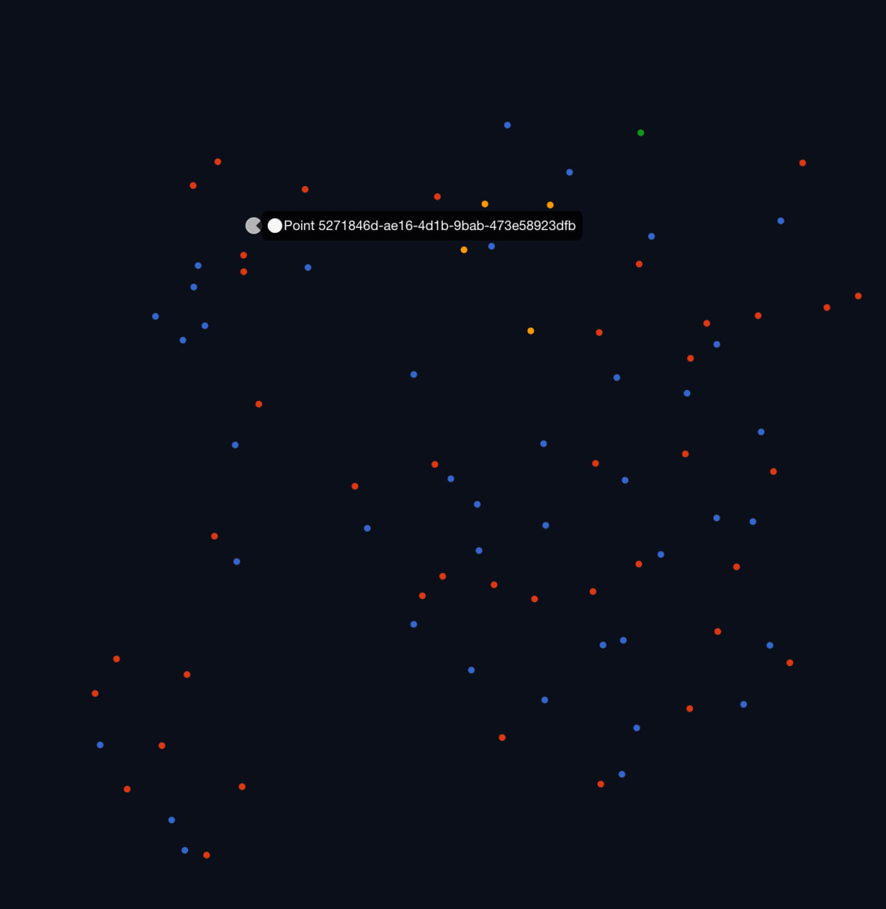
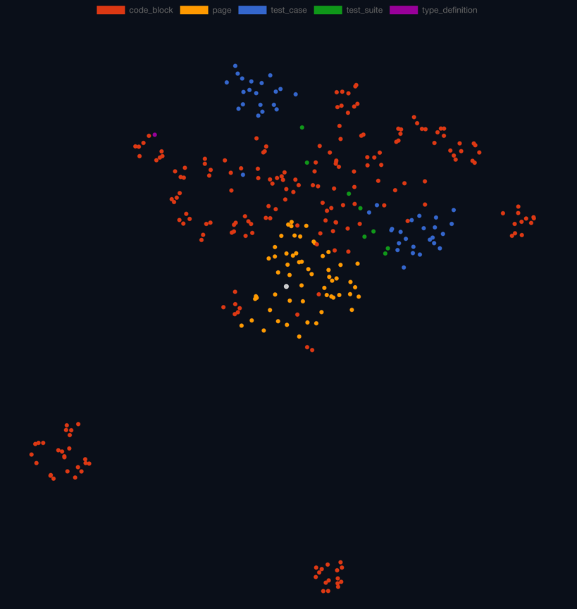

## Цели и задачи эксперимента

В рамках реализации проекта были определены несколько целей, которые достигаются посредством решения задач. 

1. **Solution brief (1–3 страницы)**
- постановка проблемы
- подход / архитектура
- почему это жизнеспособно
- какие компромиссы сделаны
2. **Coverage report (таблица)**
- Requirement (ID/название/текст)
- Coverage score (0–100% или градации)
- Список тестов, которые связаны с требованием
- Confidence score (уверенность)
- Evidence (аргументы/ссылки на тесты/фрагменты)
3. **Risk & robustness**
- ключевые риски и причины
- как измерять качество результата
- как повышать устойчивость
4. **Demo summary**
- кратко: что получилось по покрытию и какие разрывы обнаружены
- какие выводы можно сделать для команды проекта

### **Опционально (“со звёздочкой”)**

Мини-прототип на любом языке (Python/TS/Java/Kotlin/…):

CLI/скрипт/ноутбук/мини-сервис — любой формат, который хотя бы частично автоматизирует:
- индексацию тестов
- сопоставление с требованиями
- построение отчёта

---

Таким образом, данный документ закрывает одно из требований, 
но не в формальном виде - здесь скорее размышления и эксперименты, результаты будут 
опубликованы по мере их достижения. 

Что касается результатов самого сервиса - они есть уже сейчас, но исполнение
пока сильно хромает. 

Исходя из постановки, можно вычленить следующий базовый набор функционала,
который гарантированно должен быть автоматизирован за счет сервиса:

1. Взаимодействие с пользователем:
   - Получение репозитория для анализа
   - Получение требований для анализа
   - Демонстрация в удобочитаемом виде таблицы с результатами
   - Демонстрация в удобочитаемом виде сводных сведений о покрытии и рекомендаций
2. Сервисы автоматизации:
   - Индексация тестов
   - Индексация требований
   - Вычисление данных для отчета
3. Эксперименты и edge-кейсы
   - Доказательство жизнеспособности подхода
   - Допустимые компромиссы с возможными путями улучшения
   - Пути повышения устойчивости
   - Работа с рисками (в идеале - по их снижению)

---
## v0: Первые размышления.

Проанализировав задачу, я заметил что в ней можно выделить несколько 
основных этапов, которые так или иначе могут быть связаны с ИИ

Предположение следующее - не стоит отдавать LLM ту работу, под которую она не заточена.
А ту, под которую заточена, стоит отдавать только при очень хорошем контроле.

**Вывод** Помимо классического взаимодействия LLM-человек надо немного формализации для определения
целей и задач проекта.

В итоге пришел к следующему: на ЛЛМ остается то, что ЛЛМ делает хорошо 
(классификация текста, генерация ответов, человекочитаемый интерфейс на естественном языке)
Все остальное - алгоритм структуризации, критерии оценки, хранение и обработка данных - 
должны быть четко провалидированы человеком. 

Эксперимент показал, что модель жизнеспособна, но нуждается в доработках и конкретизации - 
простой эмбеддиг содержимого мало что дает, так как синтаксически тест, код и вопросы о нем
находятся в разных углах вектора и практически не имеют связи. Например, вот так выглядит первый вариант визуализации
вектора точек:

  
Как можно заметить, точки практически равномерно распределены - есть некоторые, выбивающиеся из
общей кучи, но какой-то закономерности в распределении не видно.
  
---
## v1: Попытка подогнать реальность под свои желания

Говоря о доработках, пришел к выводу:  
1. Нужна стандартизация, чтоб не тащить все отовсюду - имея единый источник правды будет проще его менять
2. В качестве источника для эмбеддинга нужно не содержимое файла/чанка, а его намерения.
3. Намерения, классификация и лексическая оценка материала - вполне пригодная история для ЛЛМ
4. Исходные данные (связь чанка с родителем, исходный текст) - все равно нужны для этапа оценки

Первая попытка рассортировать данные по чанкам привела к более интересному распределению - мало 
того что появилось множество новых точек, так эти множества стали еще и распределяться как-то (пока не по смыслу)

Продолжаем эксперимент, следующий шаг - стандартизация ех действий, что уже производились

---

